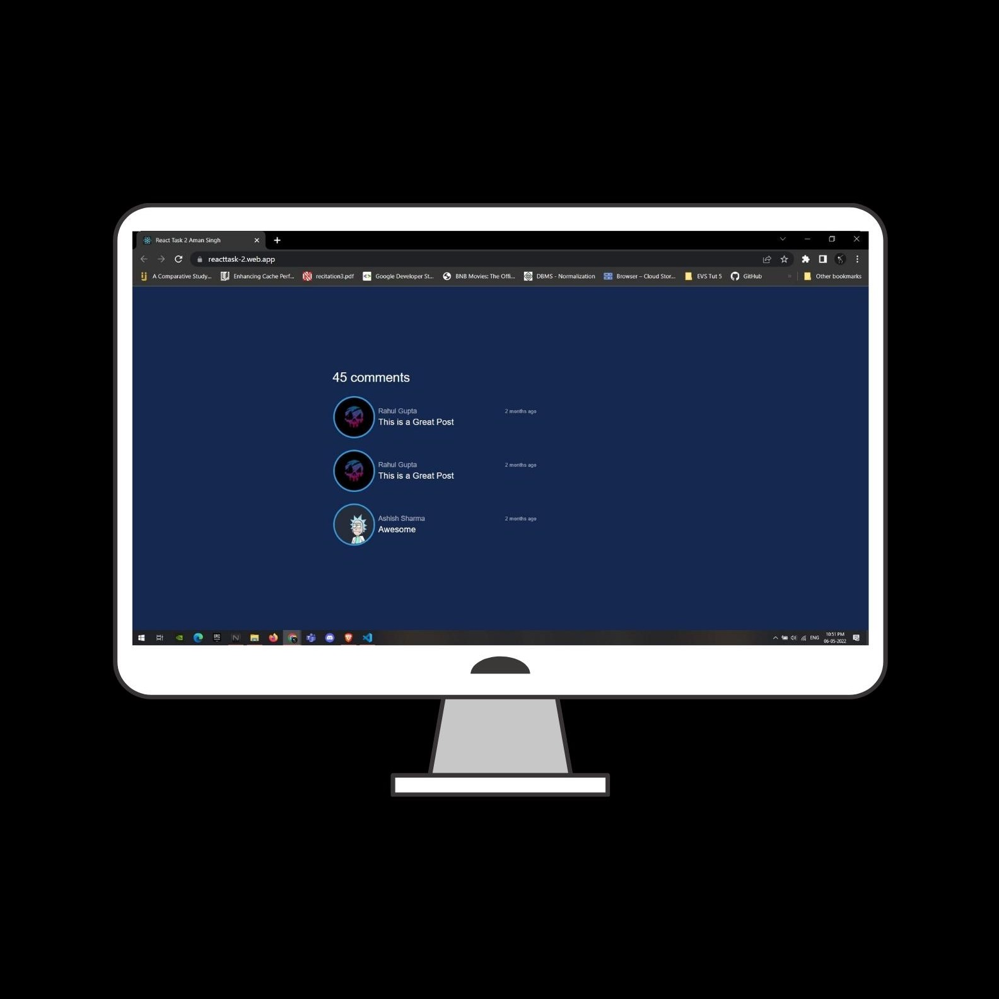
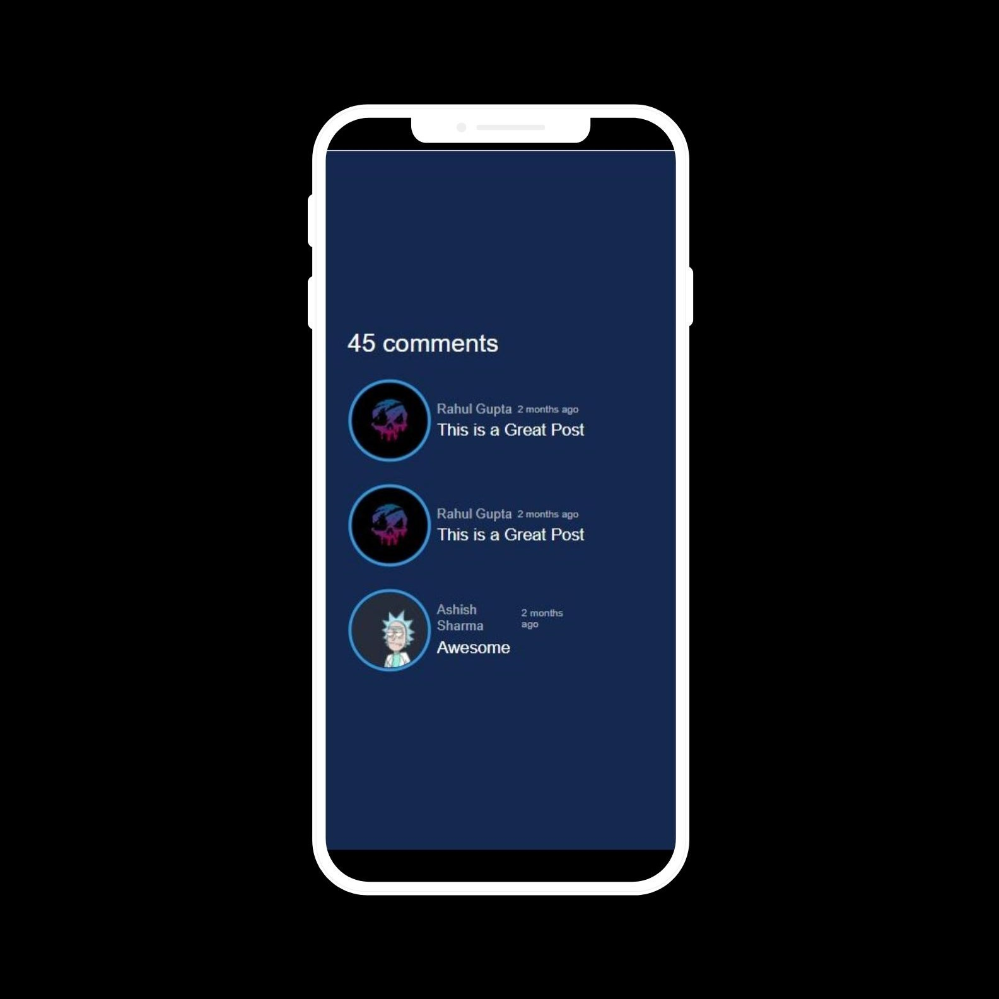

<div align="center">
  <h1 align="center"> React Task 2 Aman Singh Bhogal</h1>
</div>

<h2>Deployment Link: https://reacttask-2.web.app/</h2>

### ScreenShots:

<div align="center">
  
  
</div>

### Steps to Run on Local Machine

***

#### Note: You need to have Node.Js installed in your Local Machine if not, first install it from <a href="https://nodejs.org/en/">here</a>.
##### Step 1) Clone AmanSinghBhogal/React-Task-2.
##### Step 3) Open React-Task-2 cloned Directory in Command Prompt and run the following command (It will install all the Dependencies needed to run):
```
npm i
```
#### Step 4) Once all the dependencies are successfully installed, Run the following Command:
```
npm start
```
#### Step 5) Once the above steps are done you should get the message:
    You can now view client in the browser.
      Local:            http://localhost:3000 
      webpack compiled successfully
#### Step 6) Open Browser and go to http://localhost:3000
***
<h1 align="center">Thank You</h1>
***